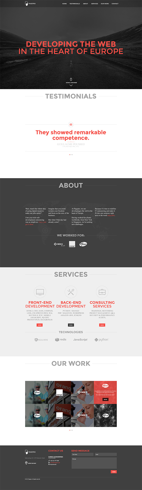

Front-end Test Project 02
=========================
Pagepro test project used for learning and recruitment.

## Project brief
- Convert the following PSD (Photoshop) web design to HTML/CSS/JS.

## Requirements
1. Create project using the latest version of [LibSasserPlate](https://github.com/Pagepro/libsasserplate)
2. Use HTML5 / SCSS
3. Create page called Home and place the elements on it
4. Use Google Webfont [Montserrat](https://www.google.com/fonts/specimen/Montserrat)
5. Add scroll down animation when clicking on "Scroll for more" link
6. Use [bxSlider](http://bxslider.com/) for testimonials and realizations sliders
7. Apply html5 input validation for contact form

## Download PSD
[front-end-test-project-02.psd.zip](front-end-test-project-02.psd.zip?raw=true) (23.7MB)

## Supported browsers
Ensure that everything works and displays correctly in the following browsers:

- Firefox (latest version)
- Google Chrome (latest version)
- Microsoft Edge
- Internet Explorer 10

## Project Delivery
Create a public repo on your Github account and share the project URL with us once it’s done.